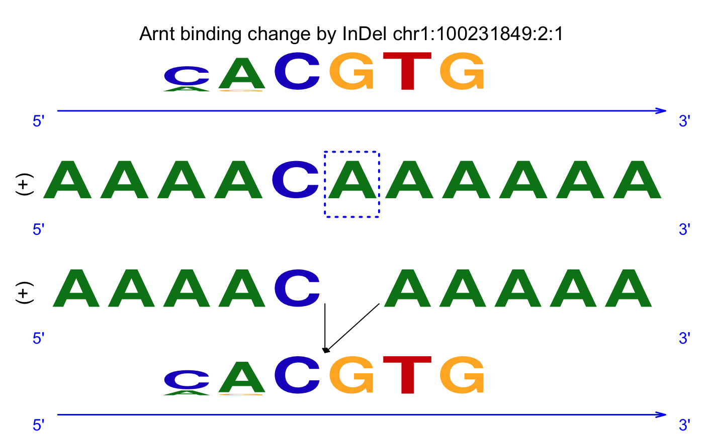

# Introduction

This document provides introduction to the binding change test (BC test) which identifies InDels that can cause the switch between on and off status of a protein-DNA binding using the package [atIndel](https://github.com/sunyoungshin/atIndel).

BC test first performs two statistical testings, one for the longer sequence and another for the shorter one, under the null hypothesis that they do not change the TF-binding affinity.  To establish the null distributions for calculating empirical p-values, we employ a Markov model to generate background DNA sequences.  Then it computes a binding-change score from the two p-values to compare the difference in the binding affinity between the original and mutant sequences.

In addition to BC test, the package provides an option to perform the score difference test. The test statistic of the score difference test is the naive score difference based on the difference between the binding scores normalized by the sequence lengths.

# R package installation

```{r}
if (!require("devtools", quietly = TRUE))
    install.packages("devtools")
library(devtools)
install_github("sunyoungshin/atIndel")
```

# Example

### 1. Load the motif library and InDel list.
```{r}
library(atIndel)
```
```{r}
data(example)
motif_lib[1:3]
indel_info[1:2]
```

### 2. Compute the TF binding scores for the reference and mutant sequences. 
```{r}
motif_scores<-indel_motif_scores(motif_lib,indel_info)$list
motif_scores
```

### 3. Compute binding change p-values and/or score difference p-values.
```{r p-val,eval = TRUE}
pval<-indel_p_values(
   motif_lib=motif_lib,
   indel_info=indel_info,
   motif_scores=motif_scores,
   prior=prior,
   trans_mat=trans_mat,
   sample_size=100,
   normalize_score_by_seq_len=TRUE,
   num_cores=2
)
pval
```

### 4. Visualize how the TF binding motif matches to the reference genome sequence and the sequence with Indel. 
```{r}
plot_indel_binding(indel_info[1],motif_scores, motif_lib[1])
```



The second and third row correspond to the reference and mutant sequences around the InDel mutation. The forward/reverse strands are marked as (+), (-), respectively. The Arnt binding motif is on the first and fourth row. The first one is located at the highest likely binding position with the reference sequence. Similarly, the other one at the bottome is at the highest likely binding position with the mutant sequence.
